# Machine Learning–Based Health Insurance Premium Prediction System 

<p align="left">
  
  
  
  
  
  
  
  
  
   
  
  
  
  
  
  
  
</p> 

 

## Overview 

## Folder Structure 

## Project Workflow 

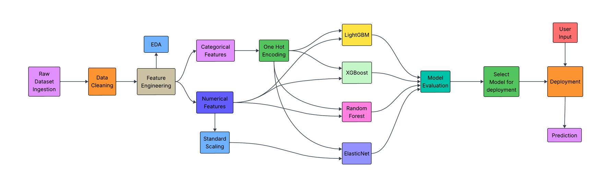 

## Dataset 

The original [Raw Dataset](https://www.kaggle.com/datasets/mohankrishnathalla/medical-insurance-cost-prediction) contains more than 50 features, including identifiers, claim aggregates, and variables that may introduce potential data leakage. For clearer analysis and modeling, related variables are organized into logical categories such as demographics, lifestyle factors, medical conditions, healthcare utilization, procedures, and insurance policy attributes, making the dataset easier to interpret and analyze. The dataset consists of 100,000 records with 54 features, capturing demographic, socioeconomic, lifestyle, clinical, and insurance-related information. With a size of approximately 21 MB in CSV format, the dataset is relatively lightweight and well-suited for experimentation in typical machine learning environments. Most variables are fully populated, with missing values present only in the `alcohol_freq` column, which were handled during preprocessing. Overall, the dataset includes a combination of 44 numerical features and 10 categorical features, providing a diverse set of predictors for exploring patterns related to healthcare utilization and insurance premium estimation. 

| Feature Group            | Column Names                                                                                                                                              | Category              | Data Type               | Description                                                                                              |
| ------------------------ | --------------------------------------------------------------------------------------------------------------------------------------------------------- | --------------------- | ----------------------- | -------------------------------------------------------------------------------------------------------- |
| Identifier               | `person_id`                                                                                                                                               | Identifier            | Integer                 | Unique identifier for each individual record in the dataset.                                             |
| Demographics             | `age`, `sex`, `region`, `urban_rural`                                                                                                                     | Demographic           | Numerical / Categorical | Basic personal characteristics describing the individual's location and gender.                          |
| Socioeconomic            | `income`, `education`, `marital_status`, `employment_status`                                                                                              | Socioeconomic         | Numerical / Categorical | Socioeconomic background variables influencing healthcare access and insurance risk.                     |
| Household Information    | `household_size`, `dependents`                                                                                                                            | Demographic           | Integer                 | Indicates number of household members and financial dependents.                                          |
| Lifestyle Factors        | `bmi`, `smoker`, `alcohol_freq`                                                                                                                           | Health / Lifestyle    | Numerical / Categorical | Behavioral and health indicators associated with medical risk factors.                                   |
| Healthcare Utilization   | `visits_last_year`, `hospitalizations_last_3yrs`, `days_hospitalized_last_3yrs`, `medication_count`                                                       | Medical Utilization   | Integer                 | Measures the individual's healthcare usage frequency and hospitalization history.                        |
| Vital Health Indicators  | `systolic_bp`, `diastolic_bp`, `ldl`, `hba1c`                                                                                                             | Clinical Measurements | Float                   | Medical test results indicating cardiovascular and metabolic health status.                              |
| Insurance Policy Details | `plan_type`, `network_tier`, `deductible`, `copay`, `policy_term_years`, `policy_changes_last_2yrs`                                                       | Insurance             | Categorical / Numerical | Characteristics of the individual's health insurance policy and coverage structure.                      |
| Risk & Provider Metrics  | `provider_quality`, `risk_score`                                                                                                                          | Derived Feature       | Float                   | Risk assessment indicators derived from health profile and provider quality rating.                      |
| Cost & Premium Variables | `annual_medical_cost`, `annual_premium`, `monthly_premium`                                                                                                | Financial             | Float                   | Total medical spending and insurance premium costs associated with the policy.                           |
| Claims Features          | `claims_count`, `avg_claim_amount`, `total_claims_paid`                                                                                                   | Insurance Claims      | Numerical               | Historical insurance claim statistics reflecting claim frequency and claim payment amounts.              |
| Chronic Condition Count  | `chronic_count`                                                                                                                                           | Medical               | Integer                 | Total number of chronic conditions recorded for the individual.                                          |
| Medical Conditions       | `hypertension`, `diabetes`, `asthma`, `copd`, `cardiovascular_disease`, `cancer_history`, `kidney_disease`, `liver_disease`, `arthritis`, `mental_health` | Medical               | Binary                  | Presence or absence of major chronic or health conditions affecting risk profile.                        |
| Medical Procedures       | `proc_imaging_count`, `proc_surgery_count`, `proc_physio_count`, `proc_consult_count`, `proc_lab_count`                                                   | Medical Utilization   | Integer                 | Counts of different medical procedures performed for the individual.                                     |
| Risk Label               | `is_high_risk`                                                                                                                                            | Target / Derived      | Binary                  | Indicates whether the individual is classified as high risk (potential data leakage if used as feature). |
| Major Procedure Flag     | `had_major_procedure`                                                                                                                                     | Medical               | Binary                  | Indicates whether the individual has undergone a major medical procedure.                                | 

The detailed data cleaning and feature engineering processes are discussed in the following sections. 

## Data Cleaning 

During the data cleaning stage, several columns were removed from the raw dataset to improve model reliability and ensure that the final features are suitable for real-world prediction scenarios. The column `person_id` was dropped because it is simply a unique identifier and does not contribute meaningful predictive information. Similarly, `provider_quality` and `risk_score` were excluded because these variables would not be available as inputs from end users of the application. In addition, the `risk_score` variable could introduce data leakage since it may already incorporate information related to the target outcome. The `monthly_premium` column was also removed because annual_premium is used as the target variable, making the monthly value redundant.

Several additional variables were removed because they represent historical insurance or claims information that application users would not realistically be able to provide. These include `policy_changes_last_2yrs`, `claims_count`, `avg_claim_amount`, and `total_claims_paid`. The column `chronic_count` was also dropped because it is simply an aggregate of ten individual disease indicator columns, making it redundant. Furthermore, the procedure-related variables `proc_imaging_count`, `proc_surgery_count`, `proc_physio_count`, `proc_consult_count`, and `proc_lab_count` were removed because they are vague and may represent medical procedures that are not appropriate or practical for machine learning prediction in this context. Finally, `is_high_risk` was excluded due to the potential for data leakage, as it likely reflects information closely related to the target variable. 

The alcohol_freq column contains the unique values 

```bash
[NaN, 'Weekly', 'Daily', 'Occasional']
```

A large portion of the entries (30,083 rows) had missing values. Since alcohol consumption is typically reported when applicable, it was reasonably assumed that these missing values represent individuals who do not consume alcohol. Therefore, the null values were imputed with the value `Never` to indicate no alcohol consumption. 

The education column contains the unique values 

```bash
['Doctorate', 'No HS', 'HS', 'Some College', 'Masters','Bachelors']
```

Some of these categories ('No HS', 'HS', and 'Some College') were abbreviated and somewhat unclear in meaning. To improve clarity and interpretability, these values were remapped to more descriptive labels, while the remaining categories were kept unchanged. This mapping enhances the readability and consistency of the education-level information in the dataset. 

```bash
{'No HS': 'High School Dropout', 'HS': 'High School', 'Some College': 'College'}
```

Finally, the entries in the trem_type column were replaced with more descriptive labels. 

```bash
{'PPO': 'Preferred Provider Organization', 'POS': 'Point-of-Service', 'HMO': 'Health Maintenance Organization', 'EPO': 'Exclusive Provider Organization'}
``` 

This transformation was performed to improve the clarity and interpretability of the variable, ensuring that the category names are easier to understand during analysis and model interpretation. 

## Feature Engineering 

## Exploratory Data Analysis 

The original dataset contains 50+ columns, including several fields such as `person_id`, `claims_count`, `avg_claim_amount`, `proc-imaging_count` and `total_claims_paid`. These variables were excluded because they are either irrelevant for predictive modeling, act as identifiers, or represent post-outcome information that would not be available during real-world predictions. In addition, the variable `is_high_risk` was removed due to data leakage, as it directly reflects information closely related to the prediction target. To ensure meaningful analysis, the exploratory data analysis was conducted using cleaned and feature-engineered dataset (derived from the raw dataset). This allows the analysis to focus only on relevant demographic, socioeconomic, and risk-related features that are actually used by the machine learning models. 

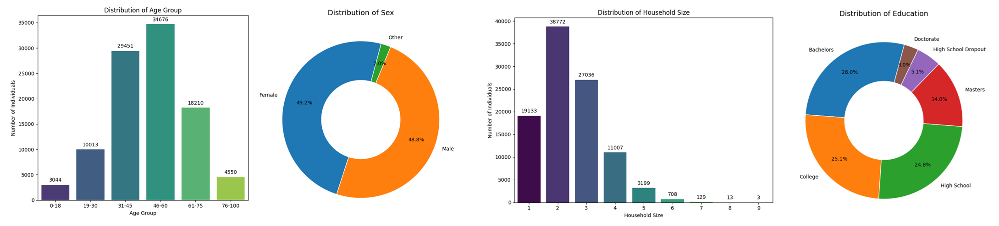 

The EDA begins with an examination of the demographic characteristics of insurance holders in the dataset. The age distribution shows that the majority of individuals fall within the range of 31 to 60 (the 46–60 group being the largest), indicating that middle-aged individuals dominate the dataset. Gender distribution is nearly balanced, with female (≈49.2%) and male (≈48.8%) populations being almost equal, while a very small fraction falls under the "Other" category. Household size analysis reveals that smaller households (homes with 2–3 rooms) are more common, while larger households (6 or more rooms) appear much less frequently. In terms of education, individuals with Bachelor’s degree holders represent the largest share (≈28%), followed by college and high school education, indicating that the dataset primarily consists of individuals with moderate to higher levels of education. 

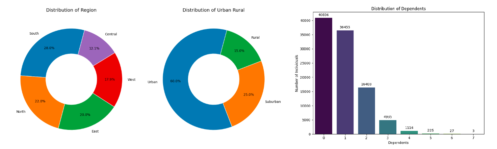 

Regional distribution shows that the South region has the highest representation, followed by the North and East, while the Central region contributes the smallest share. In terms of residential classification, the majority of individuals reside in urban areas (≈60%), with smaller proportions living in suburban (≈25%) and rural areas (≈15%), suggesting that the dataset is somewhat urban-centric. Additionally, the dependents analysis shows that most individuals have 0–1 dependents, with the frequency decreasing significantly as the number of dependents increases. 

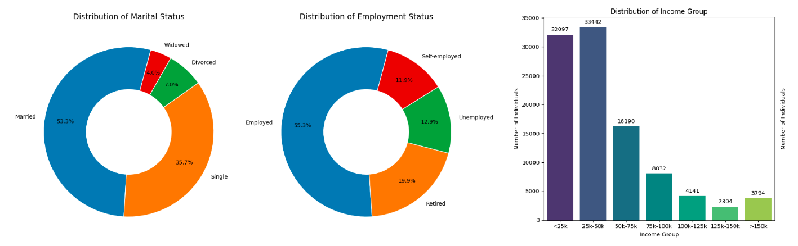 

Over half of the individuals are married (≈53%), while single individuals account for about 36%, and smaller proportions are divorced or widowed. Employment status shows that most individuals are employed (≈55%), with the remaining population distributed among retired, unemployed, and self-employed groups. Income distribution indicates that a large portion of individuals fall within the lower to middle income brackets, particularly below $50K, while relatively fewer individuals belong to higher income groups above $100K. 

<p align="center">
  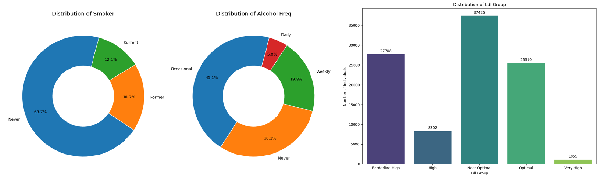
  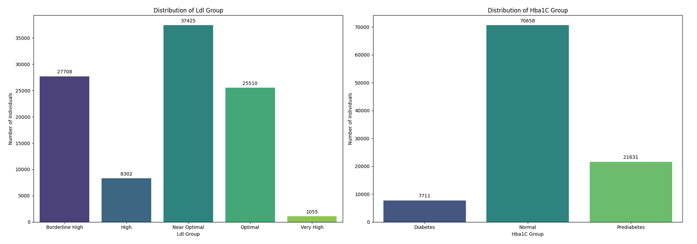
</p> 

Smoking behavior shows that the majority of individuals are non-smokers, while smaller proportions are former or current smokers. Alcohol consumption patterns indicate that occasional drinking is the most common, followed by individuals who never consume alcohol, with relatively fewer reporting weekly or daily consumption. The LDL cholesterol distribution reveals that most individuals fall within the near-optimal and optimal ranges, although a noticeable portion still lies in borderline or high-risk categories. Similarly, HbA1c levels indicate that the majority of individuals are within the normal range, while smaller segments fall into the prediabetes and diabetes categories. 

<p align="center">
  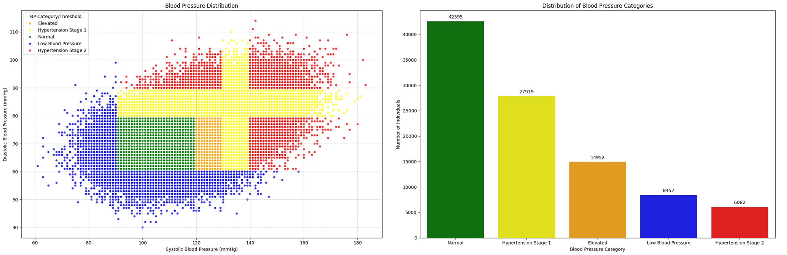
  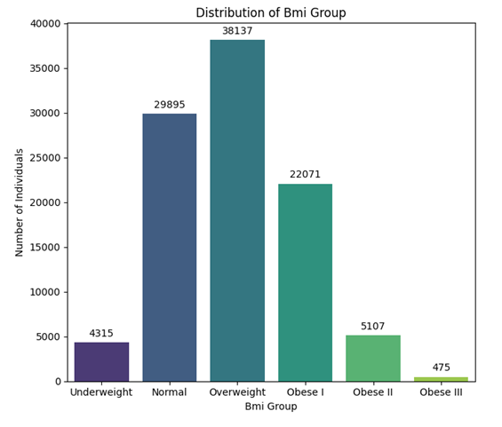
</p> 

The blood pressure scatter plot illustrates the relationship between systolic and diastolic pressure, highlighting clusters corresponding to normal, elevated, and hypertension stages. The categorized blood pressure distribution shows that normal blood pressure is the most common, followed by hypertension stage 1 and elevated blood pressure, while fewer individuals fall into low blood pressure or hypertension stage 2 categories. Body mass index (BMI) distribution indicates that overweight and normal BMI categories dominate the dataset, with smaller proportions classified as obese, underweight, or severe obesity. 

<p align="center">
  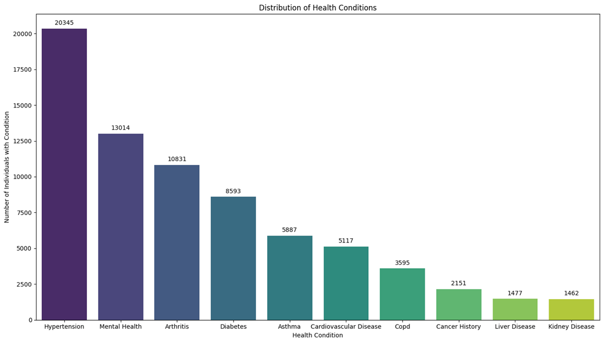
  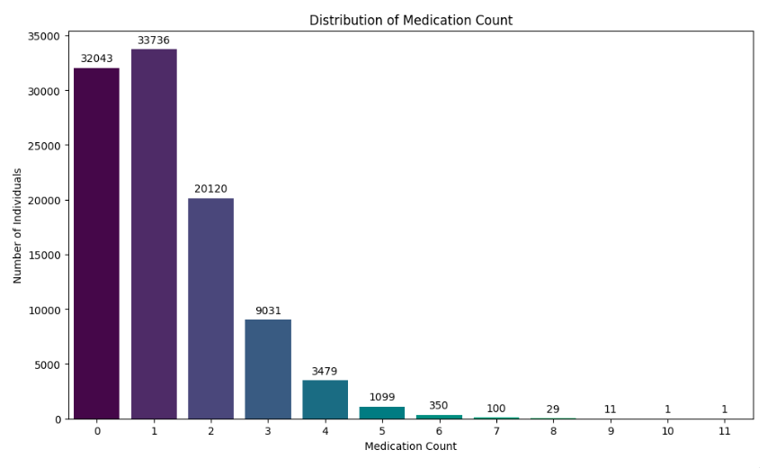
</p> 

Among reported health conditions, hypertension is the most prevalent, followed by mental health conditions, arthritis, and diabetes, while conditions such as cancer history, liver disease, and kidney disease occur less frequently. Medication usage patterns show that most individuals take zero to one medication, with the number of individuals decreasing steadily as the medication count increases, indicating that only a small fraction of the population relies on multiple medications. 

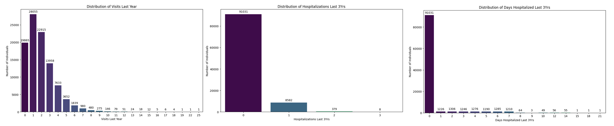 

The distribution of doctor visits in the past year shows that most individuals have 0–3 visits, with the frequency declining steadily as the number of visits increases, indicating that frequent medical consultations are relatively uncommon. The hospitalizations over the last three years reveal that the vast majority of individuals have no hospital admissions, while only a small fraction experienced one or more hospitalizations. A similar pattern appears in the number of days hospitalized, where most individuals recorded zero days, and only a very small proportion stayed in the hospital for extended periods, suggesting generally low hospitalization intensity within the population. 

<p align="center">
  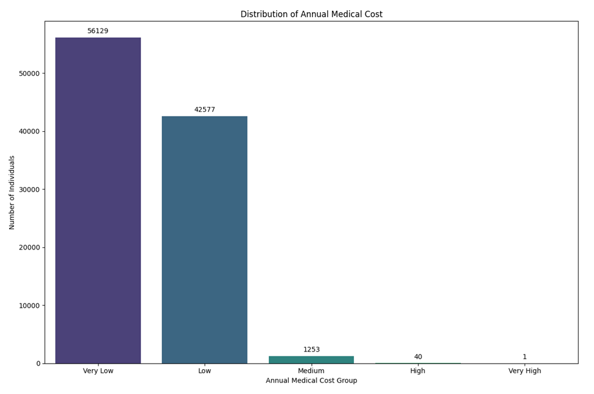
  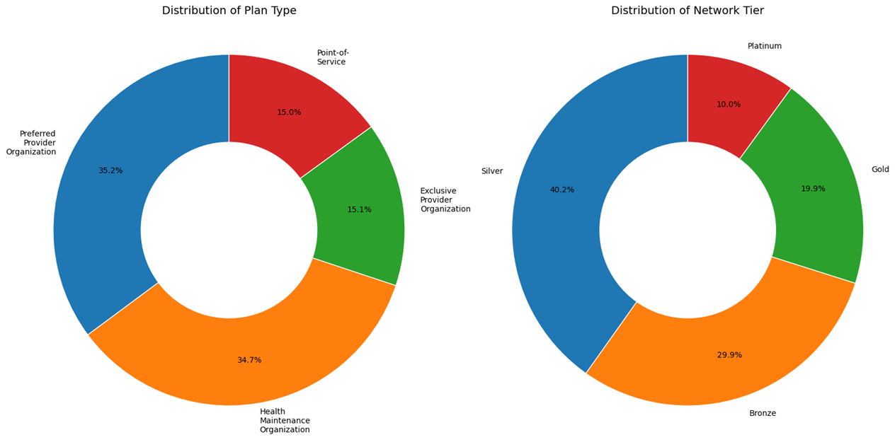
</p> 

The annual medical cost distribution shows that most individuals fall into the very low or low cost categories, with only a small number reaching medium or high cost levels, indicating that high healthcare expenditures are relatively rare. In terms of insurance plan types, the population is fairly balanced between Preferred Provider Organization (PPO) and Health Maintenance Organization (HMO) plans, while smaller shares belong to Exclusive Provider Organization (EPO) or Point-of-Service (POS) plans. The network tier distribution indicates that Silver plans are the most common, followed by Bronze, while Gold and Platinum plans represent smaller segments of the insured population. 

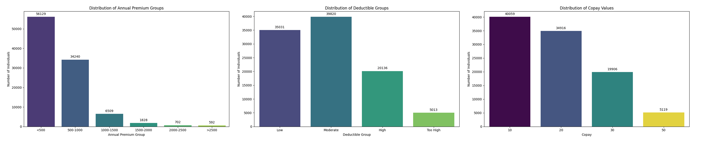 

The final visualization set examines insurance pricing and cost-sharing structures. The annual premium distribution shows that most individuals pay lower premium amounts, particularly below $1000 annually, while higher premium categories are progressively less common. The deductible distribution suggests that moderate and low deductible plans dominate, with fewer individuals enrolled in high or very high deductible plans. Lastly, the copay distribution indicates that smaller copay amounts are most common, while higher copay levels appear less frequently, reflecting typical insurance plan designs that aim to balance affordability and cost sharing for policyholders. 

## Model Training 

## Results 

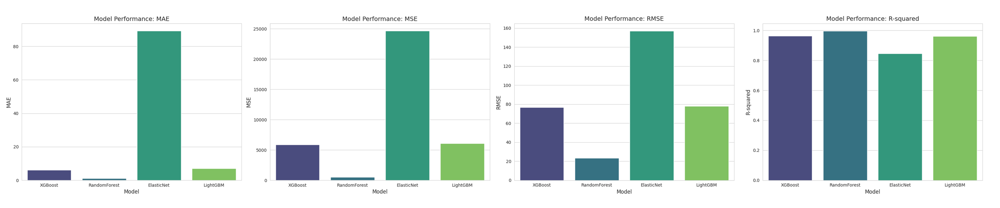 

<p align="center">
  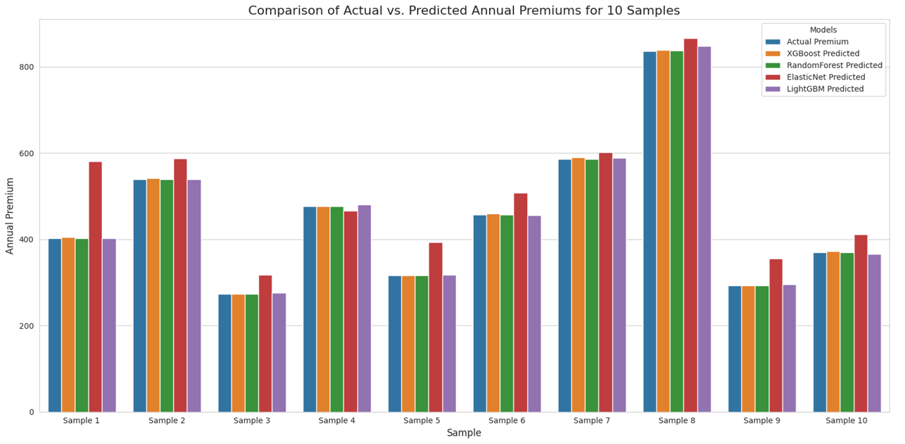
  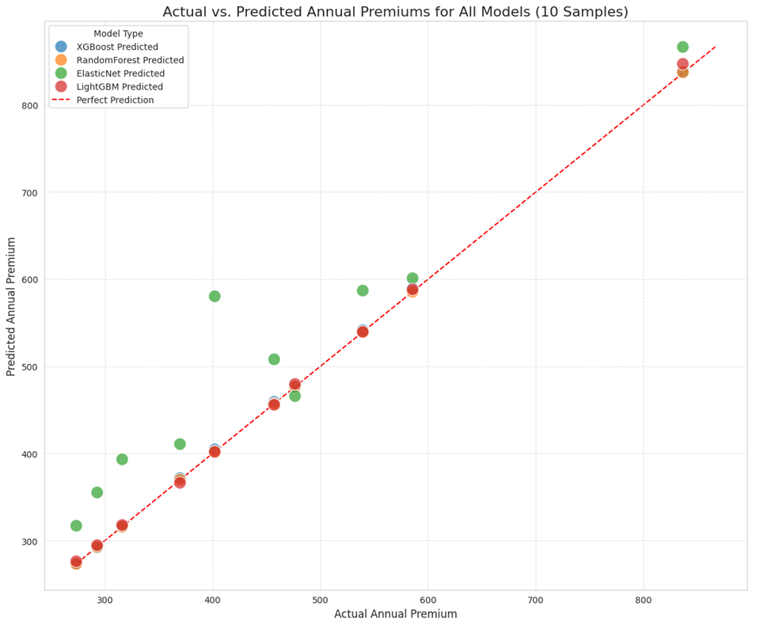
</p> 

## Practical Applications 

## Explainability 

 

The SHAP force plot shows how the model arrived at a predicted annual premium of 1,022. Starting from the base value (average premium) of 581.9, the prediction was primarily increased by the individuals high annual medical cost (6,789), which the model identifies as a strong risk factor. The selected insurance plan tier also contributed to the increase, as non-Bronze plans tend to have higher premiums. This increase was partially offset by being enrolled in a Silver plan rather than a higher-tier option. Overall, the plot provides a transparent breakdown of how each feature contributed to the final prediction. 

## Deployment 

https://health-insurance-premium-prediction-system.streamlit.app/ 

<p align="center">
  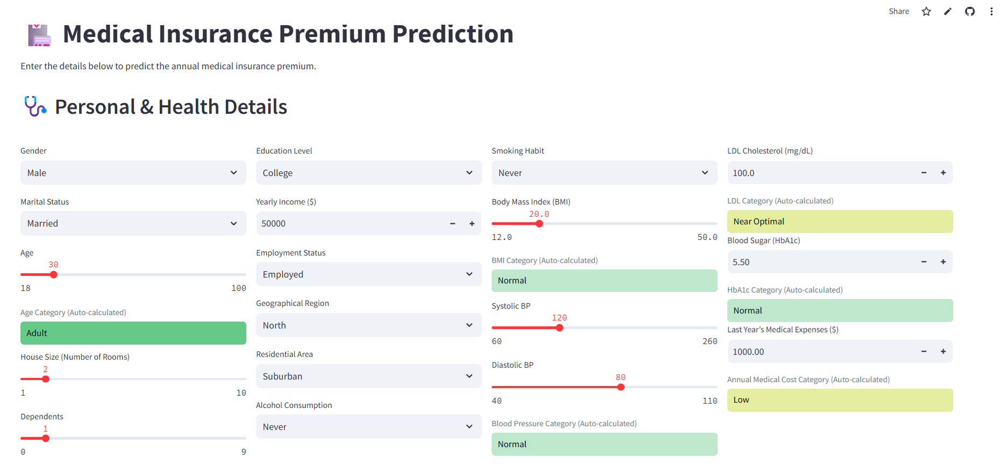
  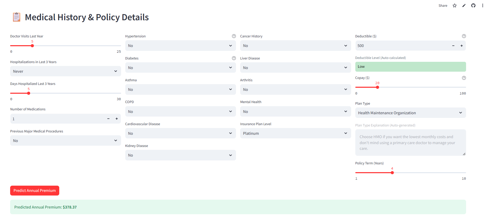
</p> 

## Limitations 

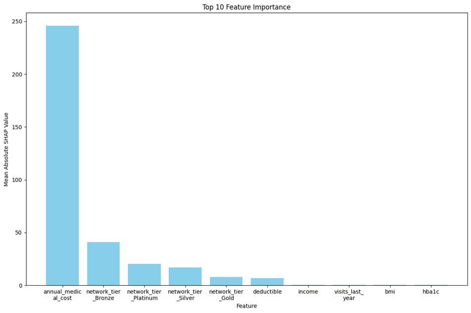 

## Tools Used 

## Licence 

## Contact 


